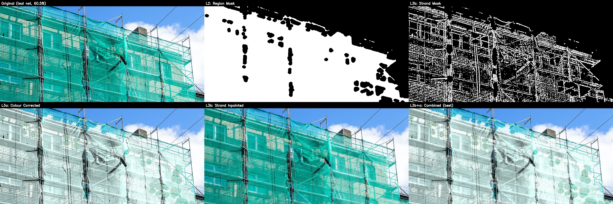
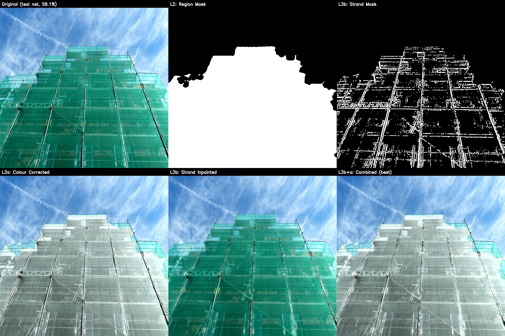
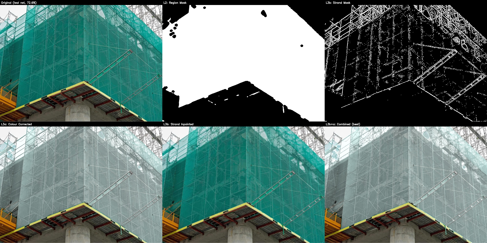
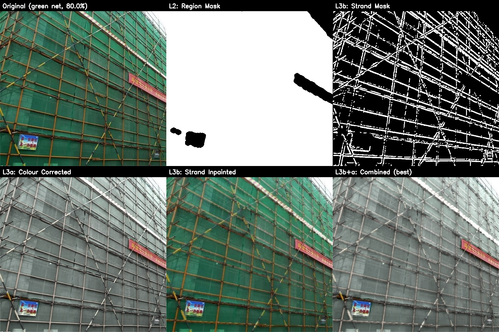
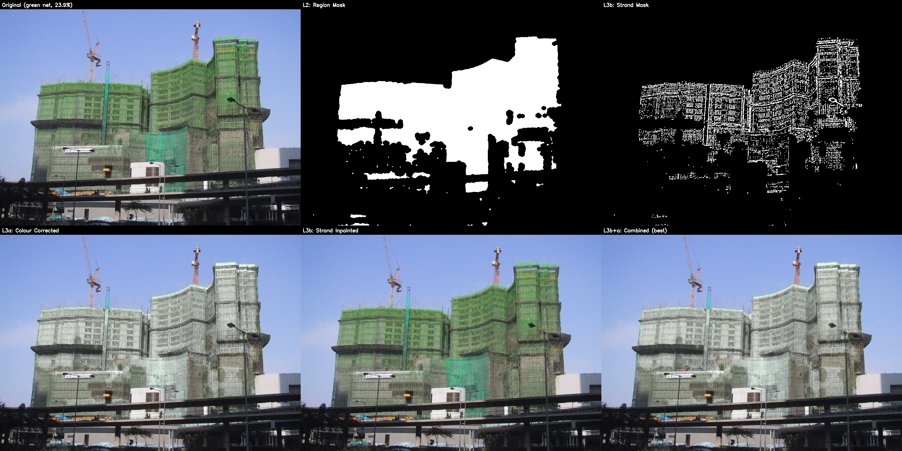
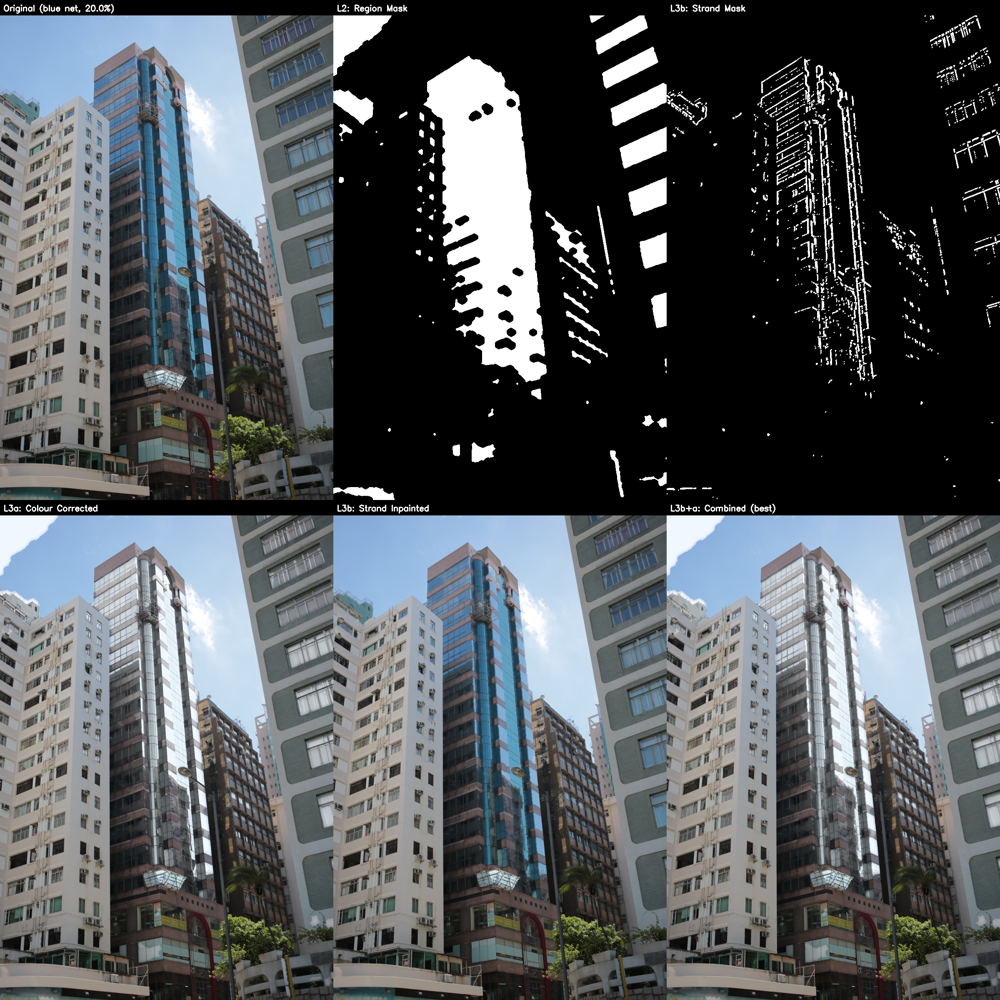
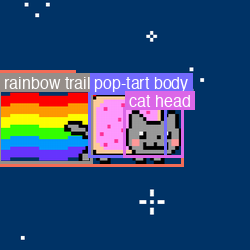

# Claude Code CV

A hands-on demonstration of computer vision and AI integration skills, built entirely in a single Claude Code session. The tasks — background removal, YOLO object detection, Gemini vision API integration, and comparative analysis — map to the technical stack of the [Scaffluent FYP project](reports/Scaffluent_meeting_notes.md).

## Reports

- [YOLO26 vs Gemini 3 Flash Comparison](reports/YOLO_vs_Gemini_Report.md) ([PDF](reports/YOLO_vs_Gemini_Report.pdf)) — 5-metric deep dive (performance, cost, adaptability, accuracy, ease of use)
- [Claude Skills Report](reports/Claude_Skills_Report.md) ([PDF](reports/Claude_Skills_Report.pdf)) — Demonstrated and further hard/soft skills tied to Scaffluent's architecture

## Scripts

| Script | Description |
|--------|-------------|
| [net_removal.py](scripts/net_removal.py) | **Net occlusion removal** — L1→L2→L3 pipeline: detect safety netting via HSV colour segmentation, generate strand masks, reconstruct underlying structure via colour correction + inpainting |
| [remove_bg.py](scripts/remove_bg.py) | Background removal via flood-fill + connected component analysis |
| [run_yolo.py](scripts/run_yolo.py) | YOLO26 Nano detection on the Nyan Cat image |
| [run_yolo_bus.py](scripts/run_yolo_bus.py) | YOLO26 Nano detection on a Madrid bus street scene |
| [gemini_describe.py](scripts/gemini_describe.py) | Gemini 3 Flash image description via OpenRouter (OpenAI SDK) |
| [gemini_structured.py](scripts/gemini_structured.py) | Gemini 3 Flash with enforced JSON schema output |
| [gemini_bbox.py](scripts/gemini_bbox.py) | Gemini 3 Flash bounding box detection + PIL visualization |
| [render_pdf.py](scripts/render_pdf.py) | Render Markdown reports to PDF via weasyprint |

## Images

### Input
| | |
|---|---|
| Nyan Cat pixel art | Madrid bus scene |
|  |  |

### Net Occlusion Removal

Removes safety netting from construction site images to reveal underlying scaffolding structure. Each comparison grid shows: original → region mask → strand mask → colour-corrected → strand-inpainted → combined (best).

**User-sourced samples** (close-up, 58–80% net coverage):

| | |
|---|---|
|  |  |
|  |  |

**Claude-sourced samples** (Wikimedia Commons, 19–25% net coverage):

| | |
|---|---|
|  |  |

### Other Output
| | |
|---|---|
| Background removed | YOLO26 detection |
|  |  |
| Gemini bbox (Nyan Cat) | Gemini bbox (bus) |
|  |  |

## Setup

```bash
python3 -m venv .venv
source .venv/bin/activate
pip install -r requirements.txt
```

Create a `.env` file with your OpenRouter API key:
```
OPENROUTER_KEY=sk-or-v1-your-key-here
```

YOLO26 model weights (`yolo26n.pt`) are auto-downloaded on first run.

## Tech Stack

- **YOLO26 Nano** — Local real-time object detection (Ultralytics)
- **Gemini 3 Flash** — Zero-shot VLM detection via OpenRouter API
- **OpenCV** — HSV segmentation, morphological masking, inpainting (Telea/Navier-Stokes)
- **PIL/Pillow + SciPy** — Image processing and visualization
- **Python 3.14** — MacBook M4, bare-metal CPU inference
